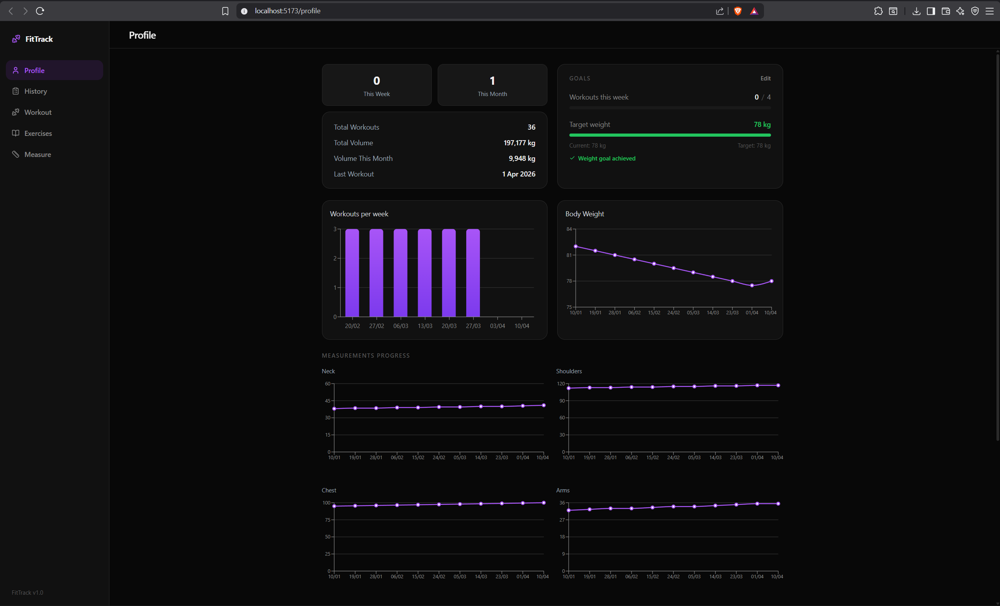
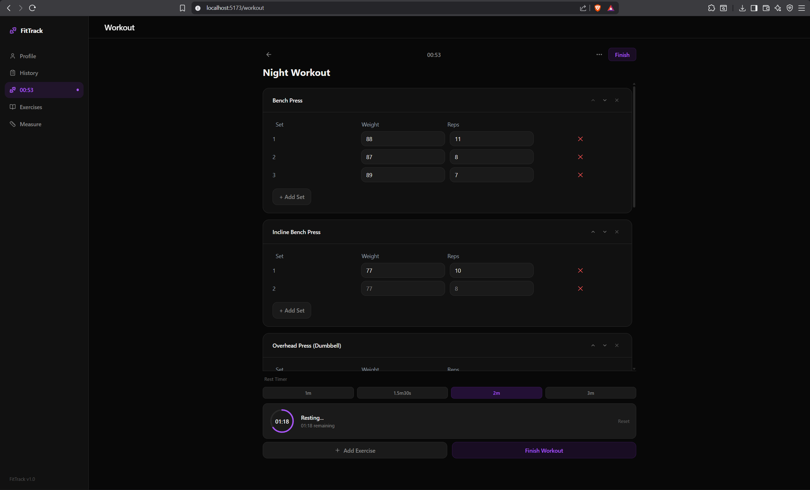
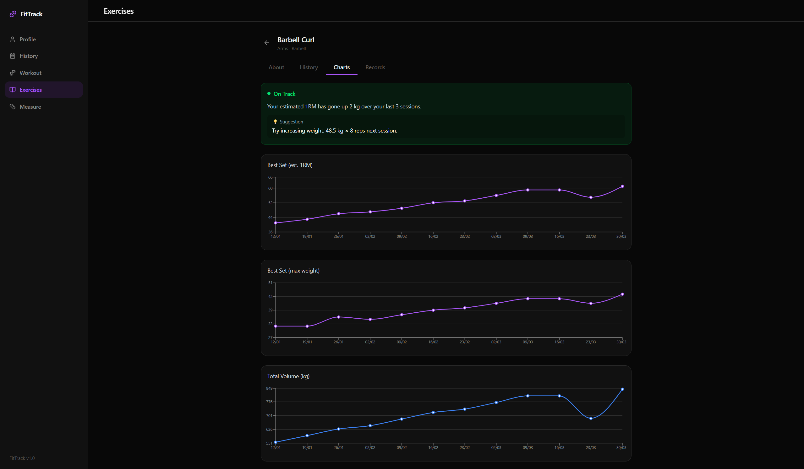
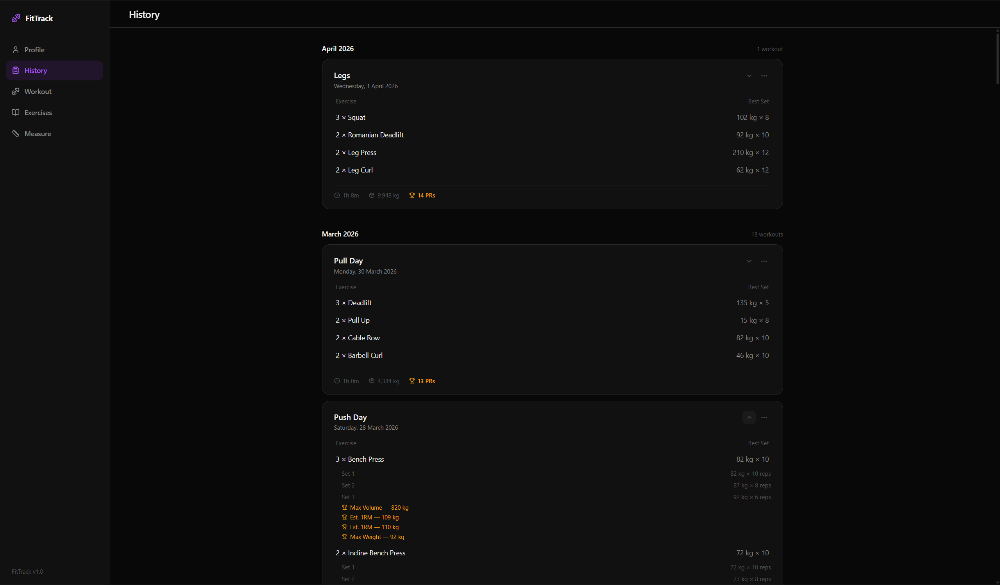
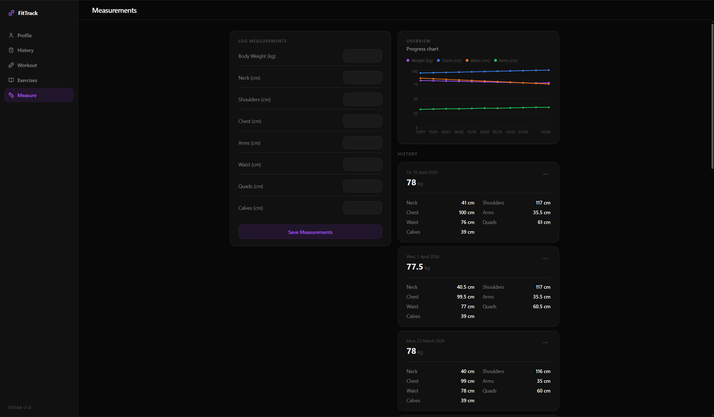

# Workout Tracker App

A full-stack fitness tracking application for managing workouts, tracking performance, and analyzing progress over time.

---

## Features

* Create and manage workout routines
* Add and customize exercises
* Track workout history and performance
* Visualize progress using charts
* Record body measurements
* Set and monitor fitness goals
* Rest timer and session tracking

---

## Tech Stack

### Frontend

* React (Vite)
* Tailwind CSS
* Context API
* Recharts

### Backend

* Node.js
* Express.js
* MongoDB (Mongoose)

---

## Project Structure

```bash
workout-app/
├── src/
│   ├── app/
│   ├── components/
│   ├── features/
│   ├── hooks/
│   ├── layouts/
│   ├── pages/
│   ├── services/
│   ├── styles/
│   └── utils/
│
└── workout-backend/
    ├── models/
    ├── routes/
    └── server.js
```

---

## Installation

### Clone repository

```bash
git clone https://github.com/R-o-Ro/workout-app.git
cd workout-app
```

### Install frontend dependencies

```bash
npm install
```

### Install backend dependencies

```bash
cd workout-backend
npm install
```

---

## Running the Application

### Start backend

```bash
cd workout-backend
npm run dev
```

### Start frontend

```bash
npm run dev
```

---

## Environment Variables

Create a `.env` file inside `workout-backend/`:

```bash
MONGO_URI=your_mongodb_connection_string
PORT=5000
```

---

## Screenshots

### Dashboard


### Workout Page


### Progress Charts


### History


### Measurements


---

## Future Improvements

* Authentication (JWT)
* Deployment (Vercel / Render)
* Improved mobile responsiveness
* Advanced analytics and insights

---

## Author

Rakshit Rathee

---

## Notes

This project is built to demonstrate full-stack development skills including frontend architecture, backend API design, and state management.
